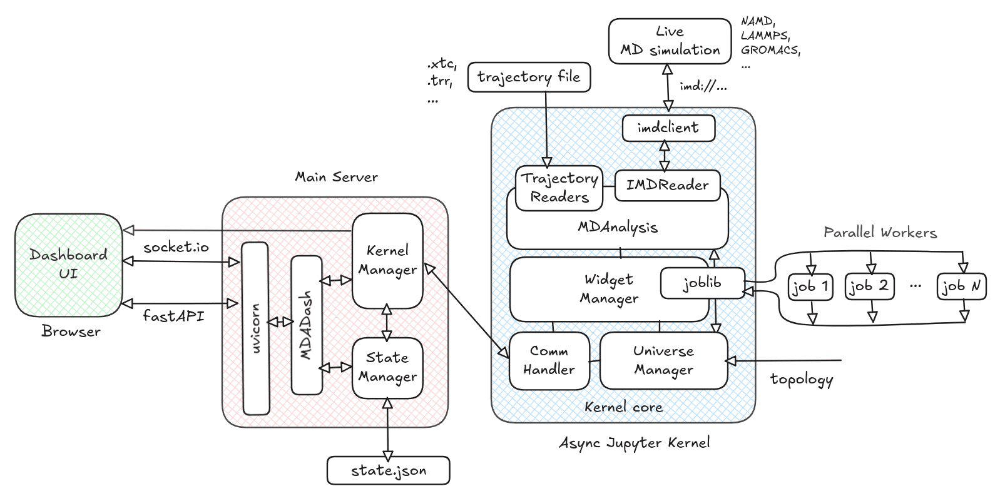
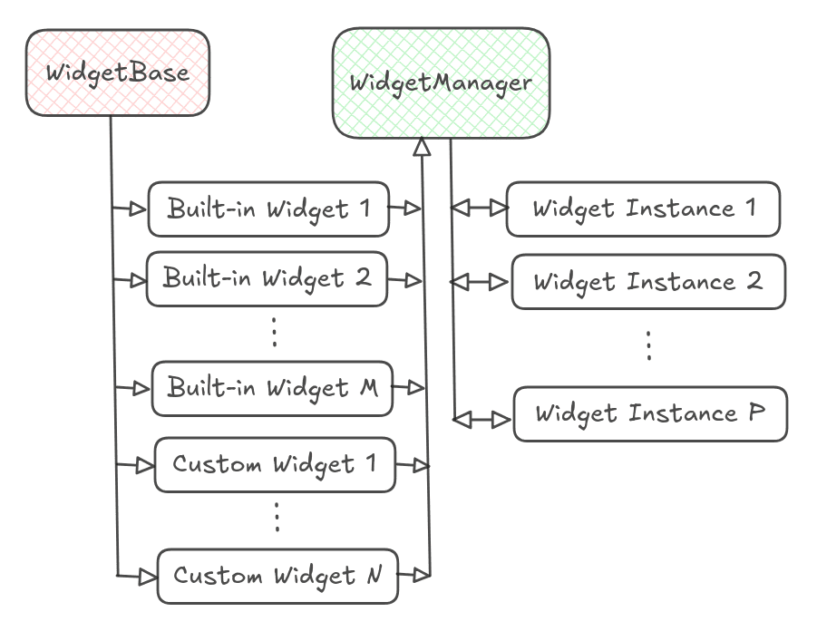

Architecture
============

`mdadash`_ is a Python command line tool. It launches a `uvicorn`_ based web server that
uses `FastAPI`_ framework combined with `python-socketio`_ to serve a web based dashboard that
can be accessed from a web browser.

A high-level architecture of `mdadash`_ looks as follows:

Processes
---------

Main Server
~~~~~~~~~~~

The main server process runs the web server and handles all interaction with the dashboard
clients (Browsers). It consists of the :ref:`MDADash <MDADash component>`, `Kernel Manager`_
and `State Manager`_ components.

Async Jupyter Kernel
~~~~~~~~~~~~~~~~~~~~

The `Main Server`_ process launches an Async Jupyter Kernel using `jupyter_client`_'s
`AsyncKernelManager`_, which runs as a separate process. All the Universe management and
Widget management that includes execution of Widgets happens in this process. It consists of
`Widget Manager`_, `Universe Manager`_ and `Comm Handler`_ components.

Parallel Workers 
~~~~~~~~~~~~~~~~

When Widgets are configured to run in parallel, additional processes could get launched which
execute the analysis code within them in parallel.

.. seealso::

    For more details see :doc:`parallelization`

Components
----------

.. _MDADash component:

MDADash
~~~~~~~

This component runs in the `Main Server`_ process and registers handlers for all the
`socket.io`_ events that could be received from the `Dashboard UI`_. It also creates
singleton instances of the `Kernel Manager`_ and `State Manager`_ components that run
within the `Main Server`_ process.

Kernel Manager
~~~~~~~~~~~~~~

This component is implemented by the :class:`~mdadash.backend.kernel.manager.KernelManager`
class. It is responsible for managing the `AsyncKernelManager`_ (starting it, stopping it)
and handling all communication to and fro from it by interfacing with the `Comm Handler`_
component on the `Async Jupyter Kernel`_ side. Because the `Async Jupyter Kernel`_ runs as
a separate process any communication with it has to go through this component.

State Manager
~~~~~~~~~~~~~

This component is implemented by the :class:`~mdadash.backend.state.manager.StateManager`
class. It is reponsible for managing the entire state of the dashboard application. It
persists the state to disk and also restores it back when the server is re-launched.

The entire state is maintained as a ``json`` file. By default, a file named ``mdadash.state.json``
in the current working directory from where `mdadash`_ is launched is used as the state file.
This can be customized using the ``--state-file`` command line param of `mdadash`_.

.. note::

    Widgets outputs are not maintained in the state file.

Widget Manager
~~~~~~~~~~~~~~

This component is implemented by the :class:`~mdadash.backend.widgets.base.WidgetManager` class.
It is responsible for managing the entire lifecycle of Widgets - listing, adding, deleting,
duplicating, re-creating, handling inputs and running them.

All Widgets derive from the :class:`~mdadash.backend.widgets.base.WidgetBase` class. This class
implements ``__init_subclass__`` method to register all widget classes automatically with the
:class:`~mdadash.backend.widgets.base.WidgetManager`.

:class:`~mdadash.backend.widgets.base.WidgetManager` is thus able to provide the list of available
Widgets to the dashboard UI and create instances from those classes to manage them as shown above.

:class:`~mdadash.backend.widgets.base.WidgetManager` uses `joblib`_ to run Widgets in separate
processes if they are configured to run in parallel (see: :doc:`parallelization`). It is responsible
for collecting the parallel jobs from the Widget instances, executing them and applying the parallel
results back to the respective Widget instances.

.. seealso::

    For more details about Widget internals, see :doc:`adding_custom_widgets`

Universe Manager
~~~~~~~~~~~~~~~~

This component is implemented by the :class:`~mdadash.backend.kernel.core.UniverseManager` class.
It is responsible for managing the MDAnalysis `Universe`_. It registers handlers with `Comm Handler`_
to handle connect / disconnect and pause / resume events. It uses an `asyncio_task`_ to run the
trajectory iteration loop and invokes the :class:`~mdadash.backend.widgets.base.WidgetManager`
to run the Widget instances during this iteration.

Comm Handler
~~~~~~~~~~~~

This component is implemented by the :class:`~mdadash.backend.kernel.core.CommHandler` class. It is
responsible for handling all communications to and from the kernel. It uses `comm`_ to handle
communications as per the standard Jupyter Kernel protocol's Comm framework. It interfaces with the
`Kernel Manager`_ component on the `Main Server`_ side.

Dashboard UI
------------

The Dashboard UI is built using `Vue.js`_ framework and `Vuetify`_ components. It uses `socket.io`_
for real-time bi-directional communication with the `mdadash`_ server (`Main Server`_).

The UI provides an easy way to add Widgets. It provides a dynamic resizable grid layout along with
search / filtering support to display Widget outputs. It provides an auto-generated layout for Widget
inputs and handles input changes in real-time. It also provides a Notebook interface to create Notebooks
with code complete and inspect support to allow users to write custom analysis code and add custom
Widgets (see :doc:`adding_custom_widgets`).

.. _mdadash: https://github.com/MDAnalysis/mdadash

.. _uvicorn: https://github.com/Kludex/uvicorn

.. _FastAPI: https://github.com/fastapi/fastapi

.. _python-socketio: https://python-socketio.readthedocs.io/en/stable/

.. _jupyter_client: https://jupyter-client.readthedocs.io/en/latest/api/jupyter_client.html

.. _AsyncKernelManager: https://jupyter-client.readthedocs.io/en/latest/
    api/jupyter_client.html#jupyter_client.manager.AsyncKernelManager

.. _Joblib: https://joblib.readthedocs.io/en/stable/

.. _Universe: https://userguide.mdanalysis.org/stable/universe.html

.. _asyncio: https://docs.python.org/3/library/asyncio.html

.. _asyncio_task: https://docs.python.org/3/library/asyncio-task.html

.. _comm: https://github.com/ipython/comm

.. _socket.io: https://github.com/socketio/socket.io

.. _Vue.js: https://github.com/vuejs/core

.. _Vuetify: https://github.com/vuetifyjs/vuetify

